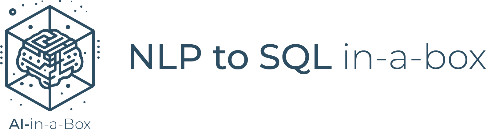
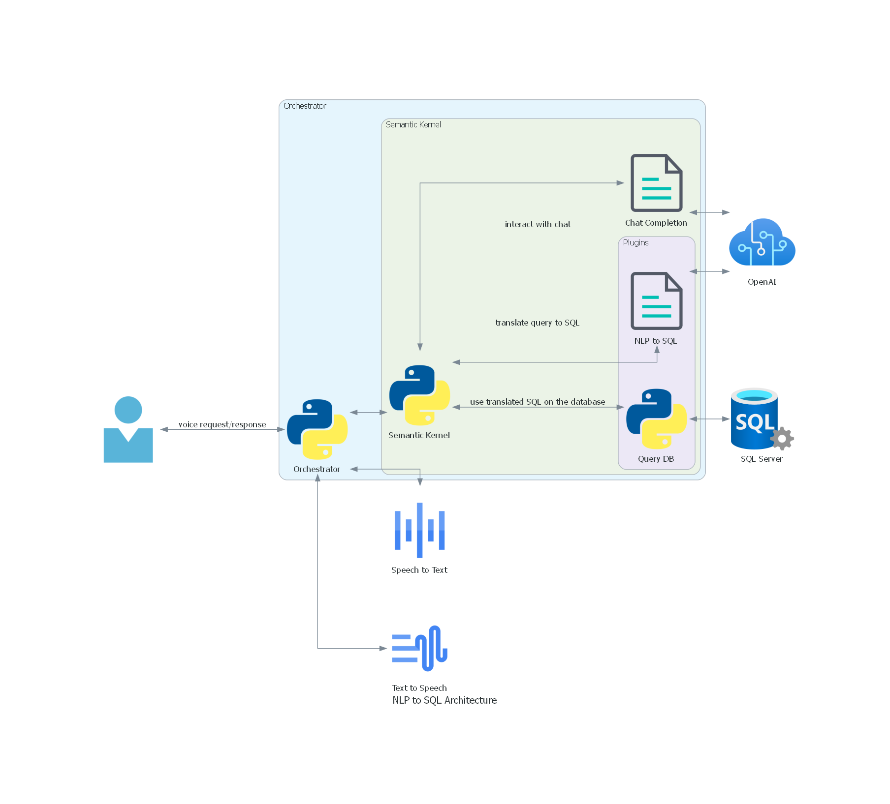

<!-- YAML front-matter schema: https://review.learn.microsoft.com/en-us/help/contribute/samples/process/onboarding?branch=main#supported-metadata-fields-for-readmemd -->

# NLP-SQL-in-a-Box

|||
|:---------------------------------------------------------------------------------------------------------------------------------------------------------------------------------------------------------------------------------------------------------------------------------------------------------------------------------| ---:|
| This solution is part of the AI-in-a-Box framework developed by the team of Microsoft Customer Engineers and Architects to accelerate the deployment of AI and ML solutions. Our goal is to simplify the adoption of AI technologies by providing ready-to-use accelerators that ensure quality, efficiency, and rapid deployment.|  |

## User Story

Build a cutting-edge speech-enabled SQL query system using Azure Open AI, Semantic Kernel, and Azure AI Speech Service

We will use the power of Azure Open AI and Semantic Kernel to translate your natural language queries into SQL statements that can be executed against an SQL Server database. This will allow you to interact with your data in a more intuitive and user-friendly way. No more struggling with complex SQL syntax – just speak your query and let the system do the rest!

And with Azure Speech Services, we will convert your speech into text and synthesize the results as speech. This means that you can hear the results of your query spoken back to you, making it easier to understand and digest the information.



## What's in the Box


- Python application that leverages [Semantic Kernel](https://learn.microsoft.com/en-us/semantic-kernel/overview/) and [Speech Services](https://azure.microsoft.com/en-us/products/ai-services/ai-speech) to build a chatbot that can:
  - Understand natural language database queries from speech
  - Translate them into SQL
  - Execute the SQL against an SQL Server database
  - Return the results as speech
- Deployment templates of all resources needed, which includes:
  - [OpenAI Service and Deployment](https://azure.microsoft.com/en-us/products/ai-services/openai-service)
  - [Speech Services](https://azure.microsoft.com/en-us/products/ai-services/ai-speech)
  - [SQL Server](https://azure.microsoft.com/en-us/products/azure-sql/database/)
- Resources are deployed and used with security best practices in mind
  - Speech and OpenAI services do not allow api keys access
  - SQL Server requires Active Directory authentication
  - Required RBAC roles are assigned to the user deploying the solution
  - Application connects to all services using azure credential

This solution was adapted from the [Revolutionizing SQL Queries with Azure Open AI and Semantic Kernel](https://techcommunity.microsoft.com/t5/analytics-on-azure-blog/revolutionizing-sql-queries-with-azure-open-ai-and-semantic/ba-p/3913513) blog post.

## Thinking Outside the Box
This solution can be adapted for many other use cases. Here are some ideas:

- Update the nlp_to_sql plugin to support more complex queries (including updates, deletes, etc.)
- Add more plugins to the semantic kernel to support additional use cases
- Add other options to interact with the kernel (e.g., a web interface, a mobile app, etc.)

## Deploy the Solution

### Deploy Pre-requisites
1. An [Azure subscription](https://azure.microsoft.com/en-us/free/)
2. Install [Azure CLI](https://docs.microsoft.com/en-us/cli/azure/install-azure-cli-windows?view=azure-cli-latest)
3. Install [Bicep](https://docs.microsoft.com/en-us/azure/azure-resource-manager/bicep/install)
4. Install [Azure Developer CLI](https://learn.microsoft.com/en-us/azure/developer/azure-developer-cli/install-azd)

### UI Deploy

[](https://portal.azure.com/#create/Microsoft.Template/uri/https%3A%2F%2Fraw.githubusercontent.com%2FAzure-Samples%2Fnlp-sql-in-a-box%2Fmain%2Finfra%2Fazuredeploy.json)

#### Required Input Parameters
The parameters below are required in order to deploy the infrastructure.
- Subscription
- Region
- Environment Name
- Principal Id
  - You can find this by running the following command:
    ```bash
    az ad signed-in-user show --query id -o tsv
    ```
- Administrator Login

#### Optional Input Parameters
- IP Address
  - If you want to allow your IP address to access the SQL Server, you can provide it here.

#### Output Parameters
After the deployment is complete, you can find the output parameters by clicking on the `Outputs` tab.
You need to create an `.env` file in the root of the project and fill it with the output parameters. The `.env` file should look like this:
```bash
AZURE_LOCATION="<azure_location>"
AZURE_OPENAI_CHAT_DEPLOYMENT_NAME="<azure_openai_chat_deployment_name>"
AZURE_OPENAI_ENDPOINT="<azure_openai_endpoint>"
SPEECH_SERVICE_ID="<speech_service_id>"
SQL_SERVER_NAME = "<sql_server_name>"
SQL_DATABASE_NAME = "<sql_database_name>"
```

Note: whenever the biceps files are changed, the `azuredeploy.json` file must be updated. To do this, run the following command:

```bash
az bicep build --file infra/main.bicep --outfile infra/azuredeploy.json
```

### Azd deploy
1. Clone this repository locally
  
    `git clone https://github.com/Azure-Samples/nlp-sql-in-a-box/`  
2. Deploy resources

    `az login`

    `azd auth login`

    `azd up`

You will be prompted for:
- environment name
- azure subscription
- azure region (we suggest using `eastus2`)
- database administrator login

When you deploy using this method, the `.env` file will be created automatically with the output parameters.

### Clean up
To remove all resources created by this solution, run:
    
`azd down`

## Run the Solution

### Run Pre-requisites
1. Install Python 3.10
2. Install [ODBC Driver for SQL Server](https://learn.microsoft.com/en-us/sql/connect/odbc/download-odbc-driver-for-sql-server) 
3. Make sure you can access the resources deployed from your local machine. 
   - By default, all resources were created with no public access.
   - You can allow your own IP address to access the resources by:
        - Find out your what's your IPv4 address
        - `azd env set IP_ADDRESS <ip_address>`
        - `azd up`
4. Install requirements
    
  `pip install -r src/requirements.txt`

### Run Locally

`python -m src.app`

The first time you run the application, it will create and populate the database with fake data. This process may take a few minutes.

#### Logging
The application will output logs to the `app.log` file, so you can use it to better understand what's happening.
If you need more information, you can change the log level to DEBUG `app.py` file:
```python
logging.basicConfig(
    filename="app.log",
    format="[%(asctime)s - %(name)s:%(lineno)d - %(levelname)s] %(message)s",
    datefmt="%Y-%m-%d %H:%M:%S",
    level=logging.DEBUG,
)
```

### Example Usage
Below you can see an example of the solution in action:

````
$ python -m src.app
Listening:
User > How many locations are there?
tool plugins-nlp_to_sql needs to be called with parameters {}
tool plugins-nlp_to_sql called and returned There are `1` tool call arguments required and only `0` received. The required arguments are: ['input']. Please provide the required arguments and try again.
tool plugins-nlp_to_sql needs to be called with parameters {"input":"How many locations are there?"}
tool plugins-nlp_to_sql called and returned ```sql
SELECT COUNT(DISTINCT Location) AS NumberOfLocations FROM ExplorationProduction;
```
tool plugins-query needs to be called with parameters {"query":"SELECT COUNT(DISTINCT Location) AS NumberOfLocations FROM ExplorationProduction;"}
tool plugins-query called and returned (1000,)
Assistant > There are 1000 distinct locations.
Listening:
User > Yes.
Listening:
User > Can you list me the top five locations by production volume?
tool plugins-nlp_to_sql needs to be called with parameters {"input":"biggest five locations by production volume"}
tool plugins-nlp_to_sql called and returned ```sql
SELECT TOP 5 Location, SUM(ProductionVolume) AS TotalProductionVolume
FROM ExplorationProduction
GROUP BY Location
ORDER BY TotalProductionVolume DESC;
```
tool plugins-query needs to be called with parameters {"query":"SELECT TOP 5 Location, SUM(ProductionVolume) AS TotalProductionVolume FROM ExplorationProduction GROUP BY Location ORDER BY TotalProductionVolume DESC;"}
tool plugins-query called and returned ('West Travishaven, Vietnam', Decimal('999300.73')),('Baileyville, Israel', Decimal('998248.91')),('Williamsborough, Wallis and Futuna', Decimal('997729.20')),('Lake Gabrielshire, Panama', Decimal('996433.80')),('Davidstad, Saint Kitts and Nevis', Decimal('994778.98'))
Assistant > Here are the five locations with the highest production volumes:

1. **West Travishaven, Vietnam**: 999,300.73
2. **Baileyville, Israel**: 998,248.91
3. **Williamsborough, Wallis and Futuna**: 997,729.20
4. **Lake Gabrielshire, Panama**: 996,433.80
5. **Davidstad, Saint Kitts and Nevis**: 994,778.98
Listening:
User > No.
````

## Customize the Solution

### Add More Plugins
You can add more plugins by:
1. Creating a new Python file in the `src/plugins` directory
2. Implementing your plugin as a class (more details in [Plugins](https://learn.microsoft.com/en-us/semantic-kernel/concepts/plugins/?pivots=programming-language-python))

### Reusing the Kernel
If you want to reuse this logic in another project, it is really easy, You just need to reuse the src/kernel package in your project, passing the required parameters.

## How to Contribute

This project welcomes contributions and suggestions. Most contributions require you to agree to a Contributor License Agreement (CLA) declaring that you have the right to, and actually do, grant us the rights to use your contribution. For details, visit <https://cla.opensource.microsoft.com>

When you submit a pull request, a CLA bot will automatically determine whether you need to provide a CLA and decorate the PR appropriately (e.g., status check, comment). Simply follow the instructions provided by the bot. You will only need to do this once across all repos using our CLA.

This project has adopted the [Microsoft Open Source Code of Conduct](https://opensource.microsoft.com/codeofconduct/). For more information see the [Code of Conduct FAQ](https://opensource.microsoft.com/codeofconduct/faq) or contact <opencode@microsoft.com> with any additional questions or comments.

## Key Contacts & Contributors

Highlight the main contacts for the project and acknowledge contributors. You can adapt the structure from AI-in-a-Box:

| Contact            | GitHub ID           | Email                    |
|--------------------|---------------------|--------------------------|
| Franklin Guimaraes | @franklinlindemberg | fguimaraes@microsoft.com |


## License

This project may contain trademarks or logos for projects, products, or services. Authorized use of Microsoft trademarks or logos is subject to and must follow [Microsoft's Trademark & Brand Guidelines](https://www.microsoft.com/en-us/legal/intellectualproperty/trademarks/usage/general). Use of Microsoft trademarks or logos in modified versions of this project must not cause confusion or imply Microsoft sponsorship. Any use of third-party trademarks or logos are subject to those third-party's policies.

## FAQ

1. ```commandline
    Server is not found or not accessible. Check if instance name is correct and if SQL Server is configured to allow remote connections. For more information see SQL Server Books Online. (11001)')
    ```
   This error is due to the fact that the SQL Server is not accessible from the machine where the application is running. Check [Run Pre-requisites](#run-pre-requisites) for more details.


---

This project is part of the AI-in-a-Box series, aimed at providing the technical community with tools and accelerators to implement AI/ML solutions efficiently and effectively.
